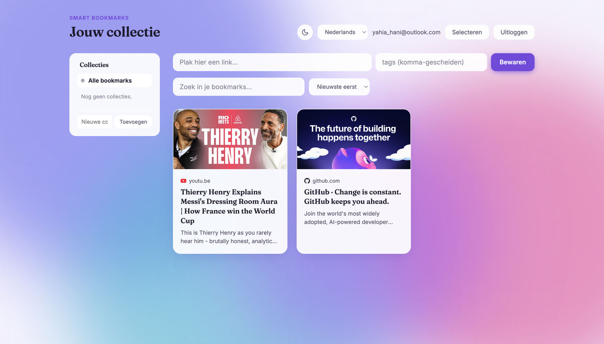
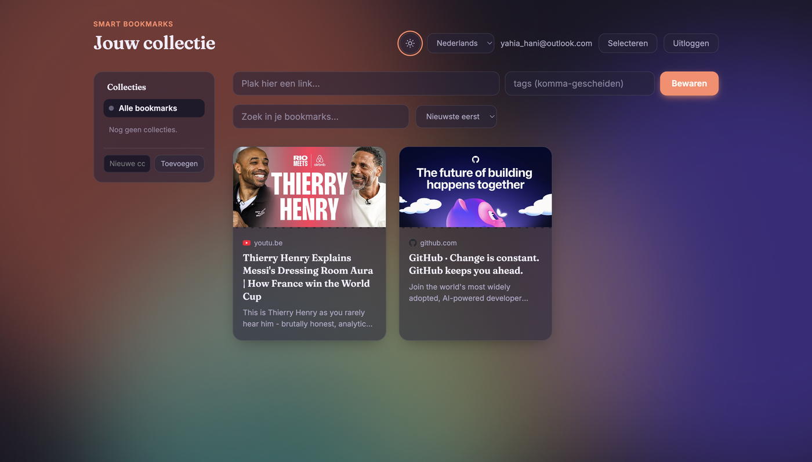
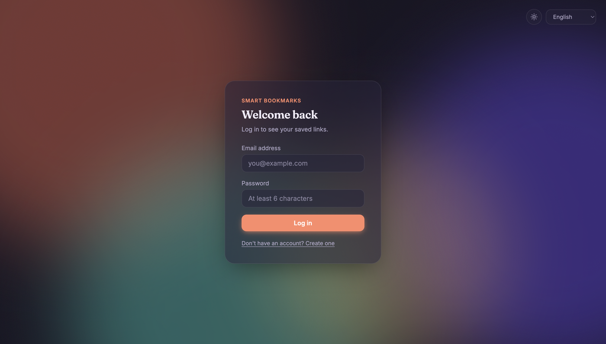
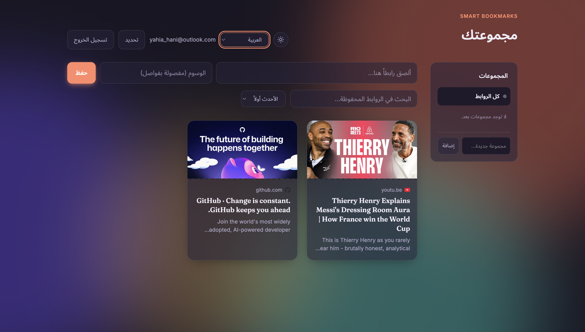

# Smart Bookmarks

A bookmark manager that automatically fetches a preview (title, description, image, and favicon) for any link you save — no manual copy-pasting required.

Paste a URL, and the app scrapes the page's metadata for you, the same way Twitter or WhatsApp generates a rich preview when you share a link.



## Features

- 🔐 **Authentication** — secure registration and login with JWT and bcrypt password hashing
- 🔗 **Automatic link previews** — scrapes title, description, image, and favicon from any URL using Open Graph metadata
- 🏷️ **Tags** — organize bookmarks with custom tags, click any tag to filter by it
- 📁 **Collections** — organize bookmarks into folders; a bookmark can belong to multiple collections at once
- 🔍 **Search & sort** — filter by title/description, sort by date or alphabetically
- ☑️ **Bulk actions** — select multiple bookmarks to tag or delete them at once
- ✏️ **Full CRUD** — add, edit, and delete bookmarks, with a confirmation step before deleting
- 🔒 **Per-user data isolation** — every user only ever sees their own bookmarks
- 🌍 **Multi-language** — Dutch, English, and Arabic, with full RTL layout support
- 🌗 **Light & dark mode** — glassmorphism design with an animated ambient background
- 📱 **Responsive** — usable down to a 375px-wide phone screen, not just a scaled-down desktop layout
- 🐳 **Dockerized** — run the entire stack (database, API, frontend) with one command
- 🧪 **Tested** — unit tests for input validation and the scraping logic

## Screenshots

| Dark mode | Login screen |
|---|---|
|  |  |

| Arabic interface (RTL) |
|---|
|  |

## Tech stack

**Backend**
- Node.js + Express
- PostgreSQL (via `pg`)
- JWT for authentication, bcrypt for password hashing
- Cheerio for HTML parsing / web scraping
- Vitest for unit tests

**Frontend**
- React (Vite)
- Plain CSS (no framework) with a custom design system — CSS custom properties for theming, logical properties for RTL support, `backdrop-filter` for the glass effect

**Infrastructure**
- Docker + Docker Compose (Postgres, Express API, and an nginx-served frontend build)

## Getting started

You can run this project either directly with Node.js, or with Docker. Docker is the faster path if you just want to see it running; running it directly is better if you want to read/modify the code as you go.

### Option A — Docker (recommended)

**Prerequisites:** [Docker Desktop](https://www.docker.com/products/docker-desktop/)

```bash
git clone https://github.com/yahyahani/smart-bookmarks.git
cd smart-bookmarks
cp .env.example .env
```
Open `.env` and set `JWT_SECRET` to a random string (generate one with `openssl rand -hex 32`).

```bash
docker compose up --build
```

This starts three containers:
| Service  | What it is                          | URL                     |
|----------|--------------------------------------|--------------------------|
| `db`     | PostgreSQL (tables created automatically on first run) | internal only |
| `server` | Express API                          | http://localhost:3001   |
| `client` | React app, built and served via nginx | http://localhost:5174  |

Open **http://localhost:5174** in your browser. Stop everything with `Ctrl+C`, or `docker compose down` to also remove the containers (add `-v` to also wipe the database volume).

### Option B — Run directly with Node.js

**Prerequisites:**
- [Node.js](https://nodejs.org/) v18+ (for native `fetch` support)
- [PostgreSQL](https://www.postgresql.org/) running locally

```bash
git clone https://github.com/yahyahani/smart-bookmarks.git
cd smart-bookmarks
createdb smart_bookmarks
```

**Backend:**
```bash
cd server
npm install
cp .env.example .env
```
Fill in your database credentials and a random `JWT_SECRET` in `.env`.

```bash
psql smart_bookmarks -f src/db/schema.sql
npm run dev
```
API runs on `http://localhost:3001`.

**Frontend** (in a new terminal):
```bash
cd client
npm install
npm run dev
```
App runs on `http://localhost:5173`.

## Running the tests

```bash
cd server
npm test
```

Unit tests cover input validation (email, password, URL, tag sanitization) and the scraping logic (metadata extraction, error handling for non-HTML responses, oversized pages), using a mocked `fetch` so no real network calls are made.

## API overview

| Method | Endpoint                                   | Description                                       | Auth required |
|--------|---------------------------------------------|----------------------------------------------------|----------------|
| POST   | `/api/auth/register`                        | Create a new account                                | No             |
| POST   | `/api/auth/login`                           | Log in and receive a JWT                            | No             |
| GET    | `/api/bookmarks`                            | List bookmarks (`?search=`, `?tag=`, `?collection=`) | Yes            |
| POST   | `/api/bookmarks`                            | Add a bookmark (scrapes metadata automatically)      | Yes            |
| PATCH  | `/api/bookmarks/:id`                        | Update a bookmark's title or tags                    | Yes            |
| DELETE | `/api/bookmarks/:id`                        | Delete a bookmark                                    | Yes            |
| GET    | `/api/collections`                          | List collections, with bookmark counts              | Yes            |
| POST   | `/api/collections`                          | Create a collection                                  | Yes            |
| PATCH  | `/api/collections/:id`                      | Rename a collection or change its color              | Yes            |
| DELETE | `/api/collections/:id`                      | Delete a collection (bookmarks stay, only the collection is removed) | Yes |
| POST   | `/api/collections/:id/bookmarks/:bookmarkId`| Add a bookmark to a collection                       | Yes            |
| DELETE | `/api/collections/:id/bookmarks/:bookmarkId`| Remove a bookmark from a collection                  | Yes            |

Authenticated requests require an `Authorization: Bearer <token>` header.

## Internationalization

The UI is available in Dutch, English, and Arabic via a small custom i18n system (`client/src/i18n`). Arabic uses a true RTL layout — the whole interface mirrors (button placement, text alignment, icon position), not just the text direction. This is done with CSS logical properties (`inset-inline-start/end`, `margin-inline`) rather than a separate RTL stylesheet, so the same CSS works for both directions automatically.

## Theming

Light and dark mode are implemented as a set of CSS custom properties (`client/src/index.css`) that switch based on a `data-theme` attribute on the `<html>` element. Components only ever reference semantic variables like `--surface` or `--ink` — they don't know or care which theme is active.

The light theme uses a vibrant gradient mesh background (indigo → pink → cyan → violet, Stripe/Linear-style), with solid white cards that visibly "float" above it thanks to a strong shadow and full opacity. The dark theme uses the same animated blob technique but with deeper colors and lower opacity, paired with semi-transparent glass cards (`backdrop-filter`) — a different mood for a different mode, rather than the same look with inverted colors.

## Project structure

```
smart-bookmarks/
├── docker-compose.yml      # Orchestrates db + server + client
├── server/                 # Express API
│   ├── Dockerfile
│   └── src/
│       ├── controllers/    # Request handling logic
│       ├── models/         # Database queries
│       ├── middleware/     # JWT auth middleware
│       ├── routes/         # API route definitions
│       ├── utils/          # Web scraping, validation (+ tests)
│       └── db/             # Database connection + schema
└── client/                 # React frontend
    ├── Dockerfile
    ├── nginx.conf
    └── src/
        ├── pages/          # Auth and Dashboard pages
        ├── components/     # Reusable UI components
        ├── i18n/           # Translations + language context
        ├── theme/          # Light/dark theme context
        └── api/            # API client
```

## What I learned building this

This project started as practice for full-stack fundamentals — JWT-based authentication, relational database design with foreign keys (including a many-to-many relationship for collections), building a REST API with proper authorization checks, and basic web scraping with Cheerio. It grew from there into a few more advanced areas: implementing real RTL support instead of just translating text, building a theme system with CSS custom properties, containerizing a multi-service app with Docker Compose, writing unit tests with mocked network calls, and making sure the UI actually holds up at phone-sized viewports (a popover that positions itself dynamically, a header that needs to gracefully drop the least essential element first, a layout that stacks instead of squeezing).

## License

MIT
